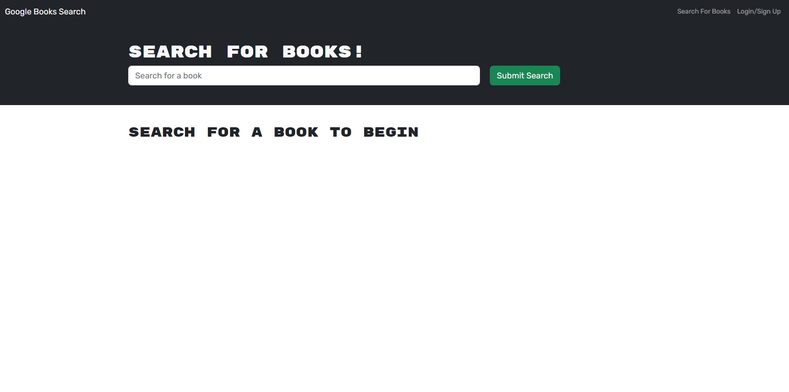

# Book Search DNF

## Technology Used

| Technology Used |                                                    Resource URL                                                    |
| --------------- | :----------------------------------------------------------------------------------------------------------------: |
| JavaScript      | [https://developer.mozilla.org/en-US/docs/Web/JavaScript](https://developer.mozilla.org/en-US/docs/Web/JavaScript) |
| Nodejs          |                                   [https://nodejs.org/en](https://nodejs.org/en)                                   |
| React           |                                       [https://react.dev](https://react.dev)                                       |
| Mongoose        |                            [https://mongoosejs.com/docs/](https://mongoosejs.com/docs/)                            |
| Apollo          |                           [https://www.apollographql.com](https://www.apollographql.com)                           |

## Description

This is a app that is able to search for any book using the google books api. It uses react generate content on the page. You can log in to save books that you like.

## Usage

Use the search bar to search for books the api does have limited uses so later in the day the site will not be able to search for books.
The login feature is incomplete.

## Learning Points

1. Learning how to use apollo client
2. Better Understanding of MERN format

## Author Info

- [GitHub](https://github.com/Jarell-Chinn)
